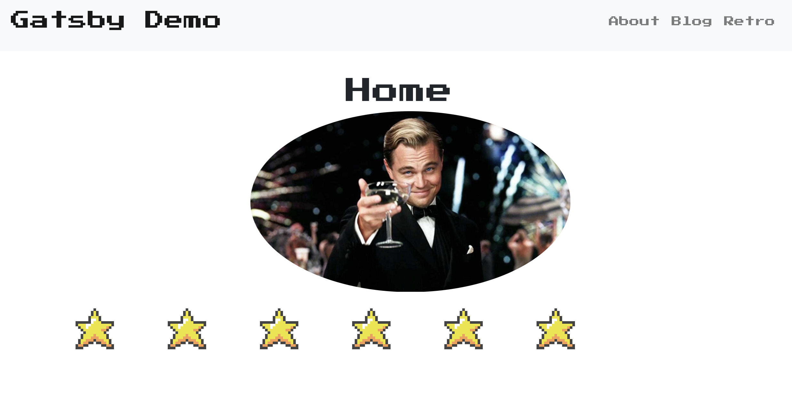
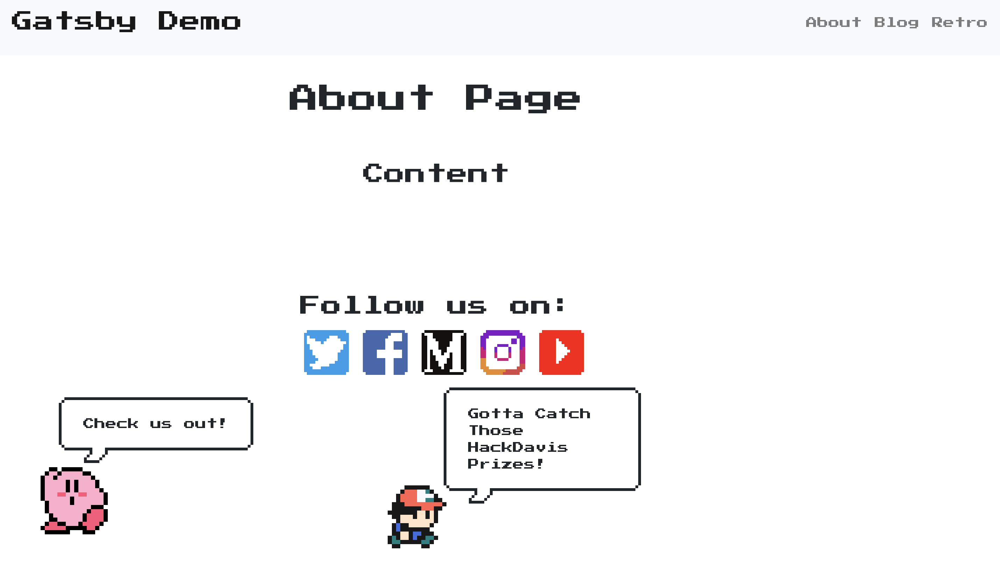
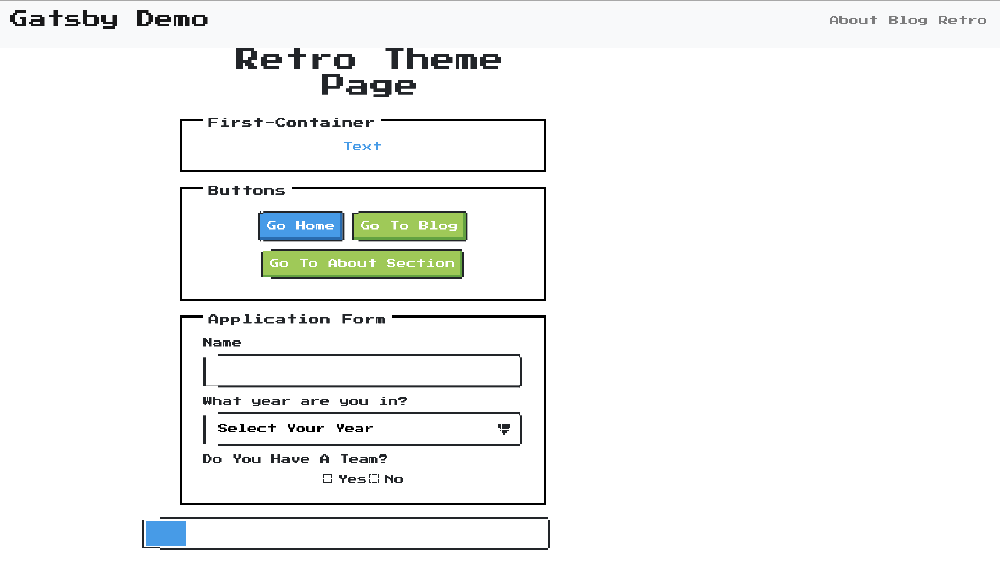
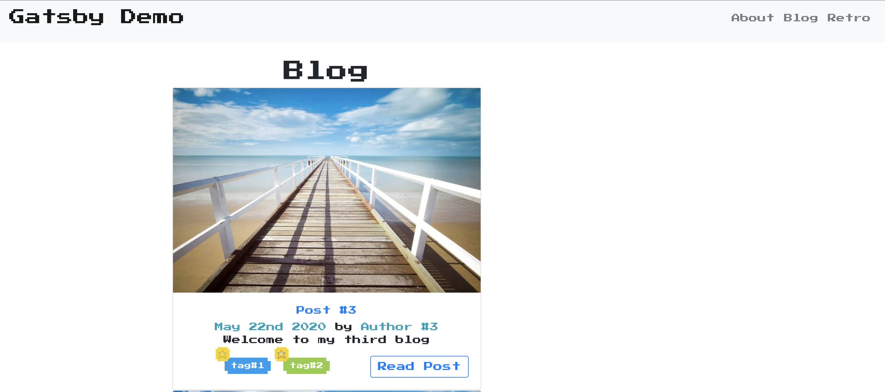

# Gatsby Demo Website

Created a retro-arcade themed website to familiarize myself with GatsbyJS and ReactJS. I used reactstrap for implementing the navbars and the outline of the blog posts. In order to get the data for each post, I had to use GraphQL to query the data inside the MD files, which are responsible for the content of the post. 

**Tech Stack:** GatsbyJS, ReactJS, HTML, CSS, Reactstrap, GraphQL, Node.js

**Credit:** 
* Gatsby Default Starter: https://github.com/gatsbyjs/gatsby-starter-default
* NES.css(Arcade Themed CSS Framework): https://github.com/nostalgic-css/NES.css
* Pixabay Images
* Youtube Videos: 
  - https://youtu.be/mHFAM0CXviE 
  - https://www.youtube.com/playlist?list=PLMhAeHCz8S3_x-jXerCYnl7jftCSxQkPV

**DISCLAIMER:** I do not own any of the images on the website 

# Website Preview

